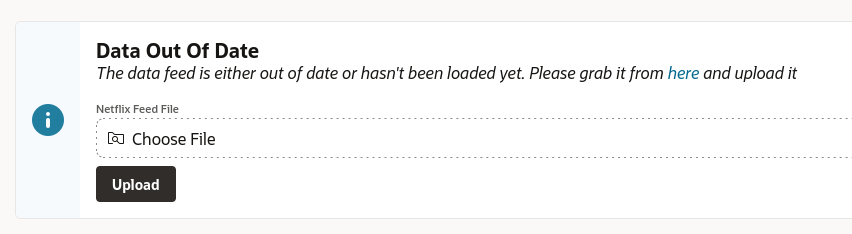

# Netflix Top 10

Using APEX to better consume "Top" lists beyond a single country.

## Installation

Connect to your parsing schema with SQLcl, and initiate the installation:

```sql
lb update -changelog-file controller.xml
```

Afer installation, you should grab the feed file and import it using the APEX application.
The landing page provides a file upload form.




## Feed File

Go to: https://www.netflix.com/tudum/top10/tv

At the bottom there are links for

* GLobal Lists
* Country Lists
* Most Popular Lists

For this sample, we are using "Country Lists" TSV. This is released each week so
if you want to keep up to date, you need to re-upload the latest version (or implement
a sync job, outside the scope of this project).
